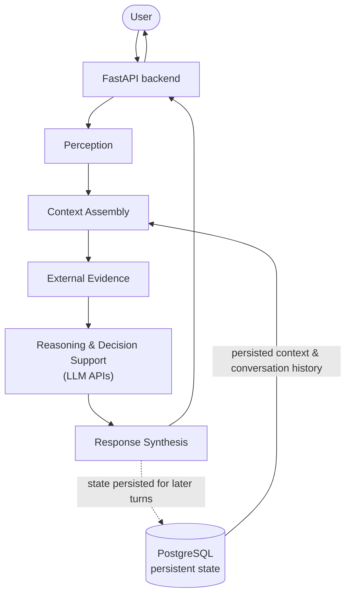

# ORCA Architecture

## Overview

ORCA is designed as a layered cognitive runtime rather than a traditional chatbot.

Instead of producing responses directly from a language model, ORCA separates intelligence into independent cognitive stages. Each stage has a specific responsibility and can evolve independently.

This architecture improves modularity, maintainability, and reasoning quality.

---

## High-Level Flow

```
User
   │
   ▼
Perception
   │
   ▼
Context Assembly
   │
   ▼
External Evidence
   │
   ▼
Reasoning & Decision Support
   │
   ▼
Response Synthesis
   │
   ▼
User
```

## System Diagram



The diagram shows the processing stages and the persistence layer only. Internal components, schemas, and the implementation are intentionally not documented here.

---

## Core Design Principles

- Layered cognitive architecture
- Separation of concerns
- Context before response
- Modular reasoning pipeline
- Explicit uncertainty handling
- Human decision support instead of decision replacement

---

> **Note**
>
> This repository intentionally documents the public architecture and engineering concepts.
> The implementation remains private while ORCA is in beta.
